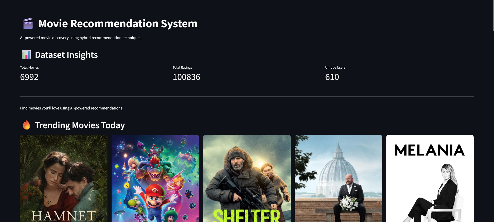
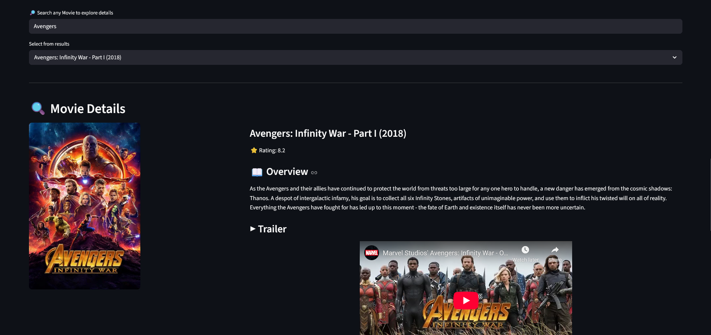
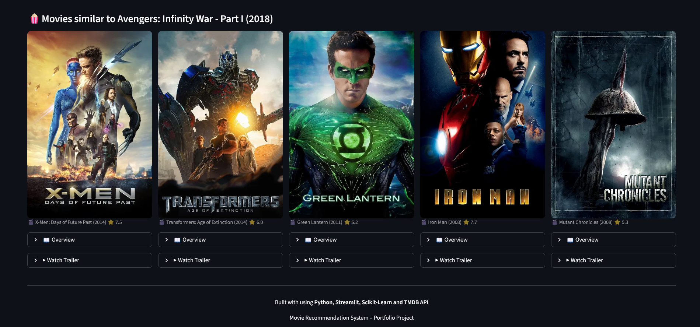
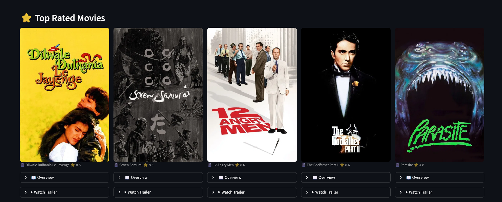

🎬 Movie Recommendation System

"Python" (https://img.shields.io/badge/Python-3.10-blue)
"Streamlit" (https://img.shields.io/badge/Streamlit-App-red)
"Machine Learning" (https://img.shields.io/badge/Machine%20Learning-Recommender%20System-green)
"TMDB API" (https://img.shields.io/badge/API-TMDB-orange)

An AI-powered Movie Recommendation System built using Python, Streamlit, and Machine Learning that recommends movies using a Hybrid Recommendation Approach combining content-based and collaborative filtering techniques.

---

🚀 Live Demo

""Live Demo" (https://img.shields.io/badge/Live-Demo-brightgreen)" (https://movie-recommendation-system-crskk3s8appkmoytnzsdmck.streamlit.app)

Try the deployed application here:
https://movie-recommendation-system-crskk3s8appkmoytnzsdmck.streamlit.app

---

📌 Features

- 🎥 AI Movie Recommendations
- 🔥 Trending Movies Section (TMDB API)
- ⭐ Top Rated Movies
- 🔎 Search Any Movie
- 🎭 Genre Filtering
- 📖 Movie Overview
- ▶ Watch Movie Trailer
- 🖼 Movie Posters
- 📊 Dataset Insights
- 🎬 Explore Movie Details

---

🧠 Recommendation Techniques

This system uses a Hybrid Recommendation Model combining:

1️⃣ Content-Based Filtering

Recommends movies based on similarity between movie attributes.

Techniques used:

- Movie Genres
- TF-IDF Vectorization
- Cosine Similarity

2️⃣ Collaborative Filtering

Recommends movies based on user rating behavior.

Techniques used:

- User-Movie Rating Matrix
- User Similarity Calculation

3️⃣ Hybrid Recommendation

Combines both techniques to improve recommendation accuracy.

---

🛠 Tech Stack

Technology| Purpose
Python| Core programming language
Streamlit| Web application framework
Pandas| Data manipulation
NumPy| Numerical computation
Scikit-learn| Machine learning algorithms
TMDB API| Movie posters, ratings, trailers
GitHub| Version control
Streamlit Cloud| Deployment

---

📂 Project Structure

movie-recommendation-system
│
├── app
│   └── app.py
│
├── models
│   └── recommender.py
│
├── data
│   ├── movies.csv
│   └── ratings.csv
│
├── notebooks
│   └── eda.ipynb
│
├── assets
│   ├── home.png
│   ├── movie_details.png
│   ├── recommendations.png
│   └── top_rated.png
│
├── requirements.txt
└── README.md

---

## 📸 Screenshots

### Home Page

### Movie Details

### Recommendations

### Top Rated Movies

---

⚙ Installation (Run Locally)

Clone the repository

git clone https://github.com/debjitdas8522/movie-recommendation-system.git

Navigate to the project folder

cd movie-recommendation-system

Install dependencies

pip install -r requirements.txt

Run the application

streamlit run app/app.py

---

📊 Dataset

The project uses the MovieLens dataset which contains:

- Movie metadata
- User ratings
- Movie genres

Used for building the recommendation models.

---

👨‍💻 Author

Debjit Das

GitHub
https://github.com/debjitdas8522

---

⭐ If you like this project

Please ⭐ the repository to support the project.